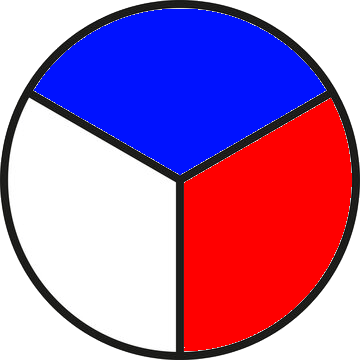

# Hjólameistarinn
 _Hjólameistarinn_ (‘the wheelmaster’) is a webapp for learners of Icelandic as a second language and tests their knowledge of inflection of nouns, verbs and adjectives in a quiz format. The mechanism of the app is similar to the one of a Wheel of fortune game: a participant is picked randomly, and a question appears about a specific form of a verb, adjective or noun. The participant has a limited number of seconds to respond orally. The app can be used during classes of Icelandic as a fun activity for learners to train their grammar skills.

Features:
- Ability to choose which word groups are tested (nouns, adjectives and/or verbs)
- Ability to remove automatically from the wheel every participant that has already responded (this is to ensure that every participants get a chance to answer once to a question)
- Data on inflectional forms are extracted from the _The Database of Icelandic Morphology_ (http://bin.arnastofnun.is)
